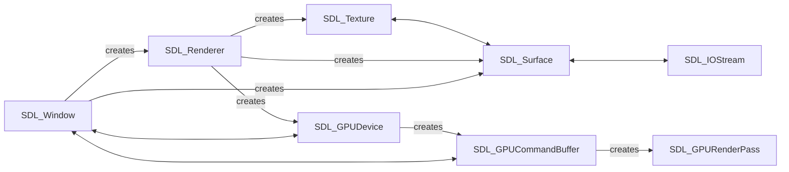

# SDL3 API Interaction Graph

This diagram shows how core SDL3 handles depend on and interact with each other.

## Subsystem Connectivity Details

### SDL_AsyncIO
- **Interacts with:** `SDL_AsyncIOQueue`

### SDL_AsyncIOOutcome
- **Interacts with:** `SDL_AsyncIOQueue`

### SDL_AsyncIOQueue
- **Interacts with:** `SDL_AsyncIO`, `SDL_AsyncIOOutcome`

### SDL_AudioSpec
- **Produces:** `SDL_AudioStream`
- **Interacts with:** `SDL_AudioStream`, `SDL_IOStream`

### SDL_AudioStream
- **Interacts with:** `SDL_AudioSpec`

### SDL_Camera
- **Produces:** `SDL_Surface`
- **Interacts with:** `SDL_CameraSpec`, `SDL_Surface`

### SDL_CameraSpec
- **Interacts with:** `SDL_Camera`

### SDL_Color
- **Interacts with:** `SDL_Palette`

### SDL_Condition
- **Interacts with:** `SDL_Mutex`

### SDL_DialogFileFilter
- **Interacts with:** `SDL_Window`

### SDL_DisplayMode
- **Interacts with:** `SDL_Window`

### SDL_FColor
- **Interacts with:** `SDL_GPURenderPass`, `SDL_Renderer`, `SDL_Texture`

### SDL_FPoint
- **Interacts with:** `SDL_FRect`, `SDL_Renderer`, `SDL_Texture`

### SDL_FRect
- **Interacts with:** `SDL_FPoint`, `SDL_Renderer`, `SDL_Texture`

### SDL_GPUBlitInfo
- **Interacts with:** `SDL_GPUCommandBuffer`

### SDL_GPUBuffer
- **Interacts with:** `SDL_GPUComputePass`, `SDL_GPUDevice`, `SDL_GPURenderPass`

### SDL_GPUBufferBinding
- **Interacts with:** `SDL_GPURenderPass`

### SDL_GPUBufferCreateInfo
- **Interacts with:** `SDL_GPUDevice`

### SDL_GPUBufferLocation
- **Interacts with:** `SDL_GPUCopyPass`

### SDL_GPUBufferRegion
- **Interacts with:** `SDL_GPUCopyPass`, `SDL_GPUTransferBufferLocation`

### SDL_GPUColorTargetInfo
- **Interacts with:** `SDL_GPUCommandBuffer`, `SDL_GPUDepthStencilTargetInfo`

### SDL_GPUCommandBuffer
- **Produces:** `SDL_GPUComputePass`, `SDL_GPUCopyPass`, `SDL_GPUFence`, `SDL_GPURenderPass`
- **Interacts with:** `SDL_GPUBlitInfo`, `SDL_GPUColorTargetInfo`, `SDL_GPUDepthStencilTargetInfo`, `SDL_GPUStorageBufferReadWriteBinding`, `SDL_GPUStorageTextureReadWriteBinding`, `SDL_GPUTexture`, `SDL_Window`

### SDL_GPUComputePass
- **Interacts with:** `SDL_GPUBuffer`, `SDL_GPUComputePipeline`, `SDL_GPUTexture`, `SDL_GPUTextureSamplerBinding`

### SDL_GPUComputePipeline
- **Interacts with:** `SDL_GPUComputePass`, `SDL_GPUDevice`

### SDL_GPUComputePipelineCreateInfo
- **Interacts with:** `SDL_GPUDevice`

### SDL_GPUCopyPass
- **Interacts with:** `SDL_GPUBufferLocation`, `SDL_GPUBufferRegion`, `SDL_GPUTextureLocation`, `SDL_GPUTextureRegion`, `SDL_GPUTextureTransferInfo`, `SDL_GPUTransferBufferLocation`

### SDL_GPUDepthStencilTargetInfo
- **Interacts with:** `SDL_GPUColorTargetInfo`, `SDL_GPUCommandBuffer`

### SDL_GPUDevice
- **Produces:** `SDL_GPUBuffer`, `SDL_GPUCommandBuffer`, `SDL_GPUComputePipeline`, `SDL_GPUGraphicsPipeline`, `SDL_GPUSampler`, `SDL_GPUShader`, `SDL_GPUTexture`, `SDL_GPUTransferBuffer`, `SDL_Renderer`
- **Interacts with:** `SDL_GPUBuffer`, `SDL_GPUBufferCreateInfo`, `SDL_GPUComputePipeline`, `SDL_GPUComputePipelineCreateInfo`, `SDL_GPUFence`, `SDL_GPUGraphicsPipeline`, `SDL_GPUGraphicsPipelineCreateInfo`, `SDL_GPUSampler`, `SDL_GPUSamplerCreateInfo`, `SDL_GPUShader`, `SDL_GPUShaderCreateInfo`, `SDL_GPUTexture`, `SDL_GPUTextureCreateInfo`, `SDL_GPUTransferBuffer`, `SDL_GPUTransferBufferCreateInfo`, `SDL_Window`

### SDL_GPUFence
- **Interacts with:** `SDL_GPUDevice`

### SDL_GPUGraphicsPipeline
- **Interacts with:** `SDL_GPUDevice`, `SDL_GPURenderPass`

### SDL_GPUGraphicsPipelineCreateInfo
- **Interacts with:** `SDL_GPUDevice`

### SDL_GPURenderPass
- **Interacts with:** `SDL_FColor`, `SDL_GPUBuffer`, `SDL_GPUBufferBinding`, `SDL_GPUGraphicsPipeline`, `SDL_GPUTexture`, `SDL_GPUTextureSamplerBinding`, `SDL_GPUViewport`, `SDL_Rect`

### SDL_GPURenderState
- **Interacts with:** `SDL_Renderer`

### SDL_GPURenderStateCreateInfo
- **Interacts with:** `SDL_Renderer`

### SDL_GPUSampler
- **Interacts with:** `SDL_GPUDevice`

### SDL_GPUSamplerCreateInfo
- **Interacts with:** `SDL_GPUDevice`

### SDL_GPUShader
- **Interacts with:** `SDL_GPUDevice`

### SDL_GPUShaderCreateInfo
- **Interacts with:** `SDL_GPUDevice`

### SDL_GPUStorageBufferReadWriteBinding
- **Interacts with:** `SDL_GPUCommandBuffer`, `SDL_GPUStorageTextureReadWriteBinding`

### SDL_GPUStorageTextureReadWriteBinding
- **Interacts with:** `SDL_GPUCommandBuffer`, `SDL_GPUStorageBufferReadWriteBinding`

### SDL_GPUTexture
- **Interacts with:** `SDL_GPUCommandBuffer`, `SDL_GPUComputePass`, `SDL_GPUDevice`, `SDL_GPURenderPass`, `SDL_Window`

### SDL_GPUTextureCreateInfo
- **Interacts with:** `SDL_GPUDevice`

### SDL_GPUTextureLocation
- **Interacts with:** `SDL_GPUCopyPass`

### SDL_GPUTextureRegion
- **Interacts with:** `SDL_GPUCopyPass`, `SDL_GPUTextureTransferInfo`

### SDL_GPUTextureSamplerBinding
- **Interacts with:** `SDL_GPUComputePass`, `SDL_GPURenderPass`

### SDL_GPUTextureTransferInfo
- **Interacts with:** `SDL_GPUCopyPass`, `SDL_GPUTextureRegion`

### SDL_GPUTransferBuffer
- **Interacts with:** `SDL_GPUDevice`

### SDL_GPUTransferBufferCreateInfo
- **Interacts with:** `SDL_GPUDevice`

### SDL_GPUTransferBufferLocation
- **Interacts with:** `SDL_GPUBufferRegion`, `SDL_GPUCopyPass`

### SDL_GPUViewport
- **Interacts with:** `SDL_GPURenderPass`

### SDL_Gamepad
- **Produces:** `SDL_GamepadBinding`, `SDL_Joystick`

### SDL_IOStream
- **Produces:** `SDL_Surface`
- **Interacts with:** `SDL_AudioSpec`, `SDL_Surface`

### SDL_IOStreamInterface
- **Produces:** `SDL_IOStream`

### SDL_Joystick
- **Produces:** `SDL_GUID`, `SDL_Haptic`

### SDL_Mutex
- **Interacts with:** `SDL_Condition`

### SDL_Palette
- **Interacts with:** `SDL_Color`, `SDL_PixelFormatDetails`, `SDL_Surface`, `SDL_Texture`

### SDL_PathInfo
- **Interacts with:** `SDL_Storage`

### SDL_PixelFormatDetails
- **Interacts with:** `SDL_Palette`

### SDL_Point
- **Interacts with:** `SDL_Rect`

### SDL_Process
- **Produces:** `SDL_IOStream`

### SDL_Rect
- **Interacts with:** `SDL_GPURenderPass`, `SDL_Point`, `SDL_Renderer`, `SDL_Surface`, `SDL_Texture`, `SDL_Window`

### SDL_Renderer
- **Produces:** `SDL_GPUDevice`, `SDL_GPURenderState`, `SDL_Surface`, `SDL_Texture`, `SDL_Window`
- **Interacts with:** `SDL_FColor`, `SDL_FPoint`, `SDL_FRect`, `SDL_GPURenderState`, `SDL_GPURenderStateCreateInfo`, `SDL_Rect`, `SDL_Surface`, `SDL_Texture`, `SDL_Vertex`, `SDL_Window`

### SDL_Storage
- **Interacts with:** `SDL_PathInfo`

### SDL_StorageInterface
- **Produces:** `SDL_Storage`

### SDL_Surface
- **Produces:** `SDL_Cursor`, `SDL_Palette`, `SDL_Renderer`, `SDL_Tray`
- **Interacts with:** `SDL_Camera`, `SDL_IOStream`, `SDL_Palette`, `SDL_Rect`, `SDL_Renderer`, `SDL_Texture`, `SDL_Tray`, `SDL_Window`

### SDL_Texture
- **Produces:** `SDL_Palette`, `SDL_Renderer`
- **Interacts with:** `SDL_FColor`, `SDL_FPoint`, `SDL_FRect`, `SDL_Palette`, `SDL_Rect`, `SDL_Renderer`, `SDL_Surface`, `SDL_Vertex`

### SDL_Tray
- **Produces:** `SDL_TrayMenu`
- **Interacts with:** `SDL_Surface`

### SDL_TrayEntry
- **Produces:** `SDL_TrayMenu`

### SDL_TrayMenu
- **Produces:** `SDL_Tray`, `SDL_TrayEntry`

### SDL_Vertex
- **Interacts with:** `SDL_Renderer`, `SDL_Texture`

### SDL_Window
- **Produces:** `SDL_DisplayMode`, `SDL_Rect`, `SDL_Renderer`, `SDL_Surface`
- **Interacts with:** `SDL_DialogFileFilter`, `SDL_DisplayMode`, `SDL_GPUCommandBuffer`, `SDL_GPUDevice`, `SDL_GPUTexture`, `SDL_Rect`, `SDL_Renderer`, `SDL_Surface`

### SDL_hid_device
- **Produces:** `SDL_hid_device_info`

