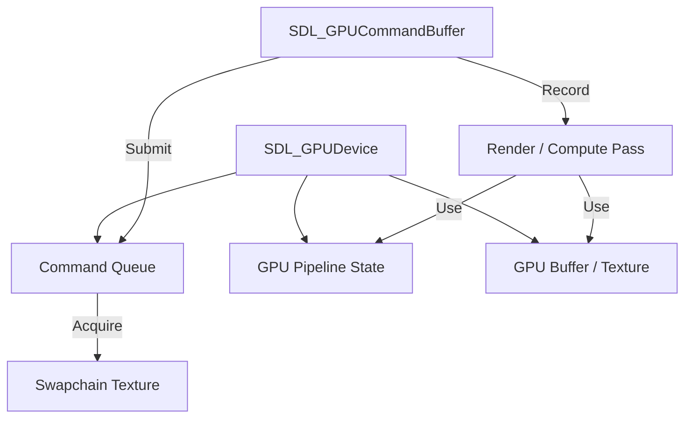

# SDL3 GPU API

The GPU API is a modern, cross-platform abstraction over Vulkan, Metal, and Direct3D 12.

## GPU Workflow

### Core Concepts:
1. **Device:** The physical/logical connection to the GPU hardware.
2. **Command Buffer:** Where you record drawing or compute instructions.
3. **Pipeline State:** Immutable state defining shaders, blending, etc.
4. **Acquire/Submit:** You acquire a texture from the swapchain, record work, and submit it to the queue.
