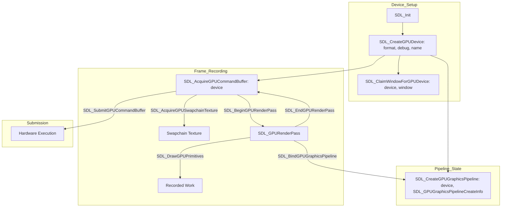

# SDL3 GPU API

The GPU API provides a modern, low-level interface for 3D graphics and compute. It is based on command recording and submission.

## GPU Workflow & Struct Dependencies

### Critical Structs
- **SDL_GPUGraphicsPipelineCreateInfo**: Huge struct defining shaders, vertex layout, blend modes, and depth testing.
- **SDL_GPUCommandBuffer**: Represents a "to-do list" for the GPU.
- **SDL_GPURenderPass**: Scoped object for drawing into specific textures.
- **SDL_GPUBuffer**: Created via `SDL_CreateGPUBuffer`, used for vertices, indices, or uniforms.
