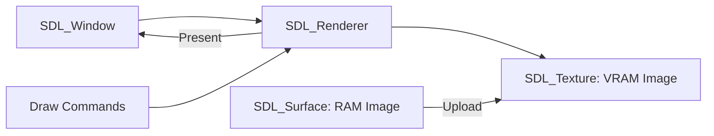

# SDL3 Video & 2D Rendering

SDL3 provides several ways to draw to a window. The most common for 2D is the **SDL_Renderer** API.

## 2D Rendering Pipeline

### Key Differences in SDL3:
- **Properties:** Almost all creation functions now take a `props` ID for extended configuration.
- **Logical Size:** Better handling of DPI and high-density displays.
- **Colors:** Deep color and HDR support.
