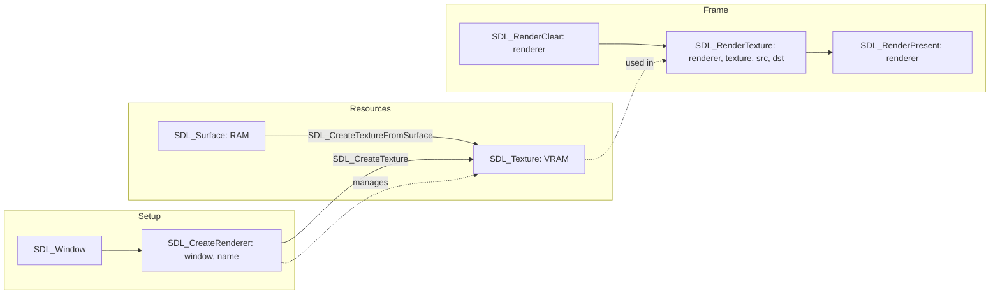

# SDL3 Video & 2D Rendering

The 2D Renderer API is the easiest way to get high-performance graphics without writing shaders manually.

## 2D Rendering Pipeline

### Detailed Calls
1. **SDL_CreateWindow**: Returns `^Window`.
2. **SDL_CreateRenderer**: Takes `^Window`, returns `^Renderer`.
3. **SDL_RenderClear**: Prepares the `^Renderer` for a new frame.
4. **SDL_RenderTexture**: Commands the GPU to copy bits from `^Texture` to the backbuffer.
5. **SDL_RenderPresent**: Swaps the backbuffer to the `^Window`.
