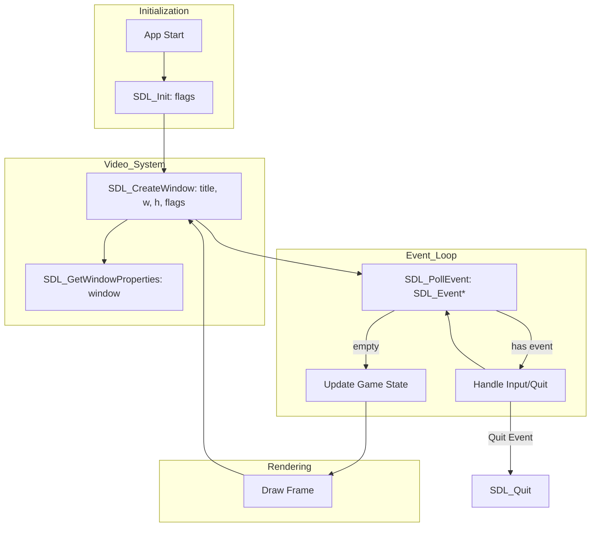

# SDL3 Architecture Overview

> [!WARNING]
> This documentation was quickly **vibecoded** to provide a rapid overview of the SDL3 API for Odin and C. 
> 
> Due to the heuristic nature of the regex-based extraction, some symbols may be missing, incorrectly parsed, or poorly formatted. The **main source of truth** is always the [Official SDL Wiki](https://wiki.libsdl.org/SDL3) and the actual source headers/bindings. Use this as a QoL browsing tool, but expect bugs. **No warranty!**

## External Resources
- **Official SDL3 Wiki:** [wiki.libsdl.org/SDL3](https://wiki.libsdl.org/SDL3)
- **Odin SDL3 Bindings:** [vendor:sdl3](https://github.com/odin-lang/Odin/tree/master/vendor/sdl3) (Check your local `vendor` directory)
- **SDL3 GitHub:** [libsdl-org/SDL](https://github.com/libsdl-org/SDL)

## General Lifecycle & Subsystems

## Interactive Object API
This documentation automatically groups functions by the "Object" (Handle) they operate on. When you view a **Struct** or **Handle** page, you will find a **Functional API** section listing:
- **Constructors**: Functions that create the object (return the pointer).
- **Methods**: Functions that take the object as their first parameter.
- **Destructors**: Functions that cleanup the object (Destroy/Free/Close).

### Structs & Dependencies
- **SDL_InitFlags**: Bit-set passed to `SDL_Init`.
- **SDL_Window**: Created by `SDL_CreateWindow`.
- **SDL_Event**: Union struct populated by `SDL_PollEvent`.

---
*This documentation generator is public domain ([Unlicense](https://unlicense.org)). SDL3 is licensed under the [Zlib License](https://github.com/libsdl-org/SDL/blob/main/LICENSE.txt). *
