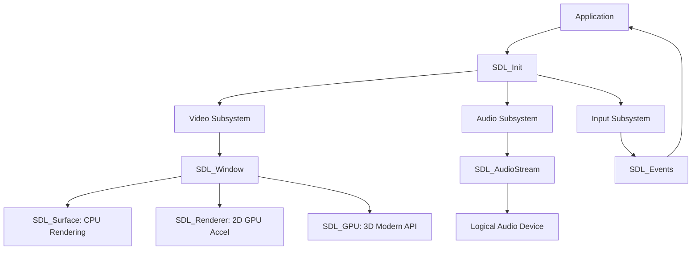

# SDL3 Architecture Overview

Welcome to the SDL3 Documentation. This guide provides a high-level view of how SDL3 subsystems interact.

## Core Subsystems Relationship

## Basic Initialization Flow

1. **SDL_Init**: Initialize the subsystems you need (Video, Audio, etc.).
2. **Create Window**: Use `SDL_CreateWindow`.
3. **Choose Rendering Path**:
    - **Renderer**: Easiest for 2D games.
    - **GPU**: For modern 3D or high-performance graphics.
    - **Surface**: For simple CPU-based pixel manipulation.
4. **Main Loop**:
    - Poll events via `SDL_PollEvent`.
    - Update state.
    - Render frame.
5. **SDL_Quit**: Cleanup on exit.
