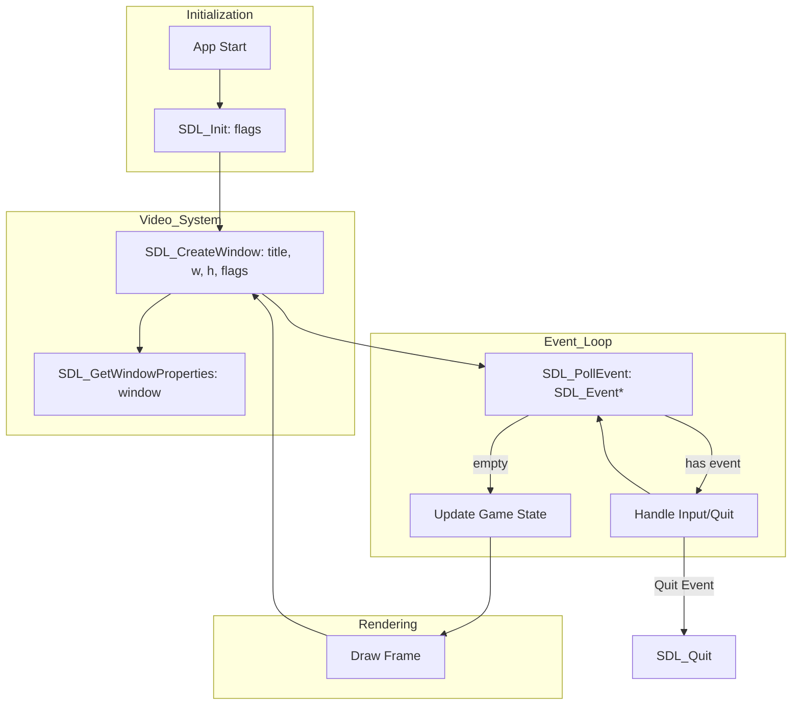

# SDL3 Architecture Overview

SDL3 is organized into several semi-independent subsystems. Most applications follow a standard lifecycle of initialization, window creation, event polling, and rendering.

## General Lifecycle & Subsystems

### Structs & Dependencies
- **SDL_InitFlags**: Bit-set passed to `SDL_Init` (e.g., `SDL_INIT_VIDEO`, `SDL_INIT_AUDIO`).
- **SDL_Window**: Created by `SDL_CreateWindow`, owned by the Video subsystem.
- **SDL_Event**: Union struct populated by `SDL_PollEvent` or `SDL_WaitEvent`.
